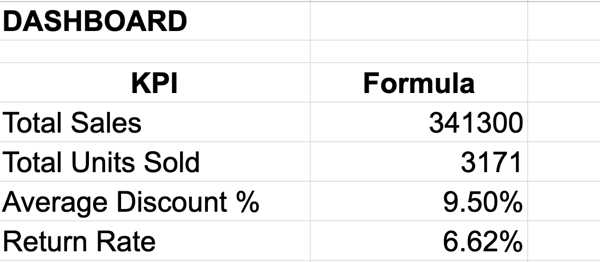

# Retail Sales Performance Dashboard

## 📌 Project Overview
This project simulates how a retail business analyst evaluates store and department performance using sales and operational data. The dashboard provides KPI tracking, trend analysis, and performance comparisons across departments and store locations.

## 🗂 Dataset
The dataset contains simulated retail performance data across multiple stores and departments, including:
- Revenue
- Units sold
- Discount levels
- Product returns
- Monthly performance

## 📊 Key KPIs Tracked
- Total Sales Revenue
- Total Units Sold
- Average Discount %
- Return Rate

## 📈 Analysis Performed

### 1. Department Performance
Identified which product categories drive the most revenue.

### 2. Monthly Sales Trend
Analyzed how revenue changes over time to detect seasonality and performance shifts.

### 3. Store Performance Comparison
Compared sales performance between store locations to highlight high- and low-performing stores.

### 4. Return Rate Analysis
Measured return rates by department to identify potential product or operational issues impacting profitability.

## 🛠 Tools Used
- Google Sheets (Dashboard & Pivot Analysis)
- Data Visualization (Charts & KPI tracking)
- GitHub (Project documentation)

## 🎯 Business Value
This project demonstrates how retail analysts use performance metrics to support merchandising decisions, store performance reviews, pricing strategies, and operational improvements.
## 📷 Dashboard Preview

